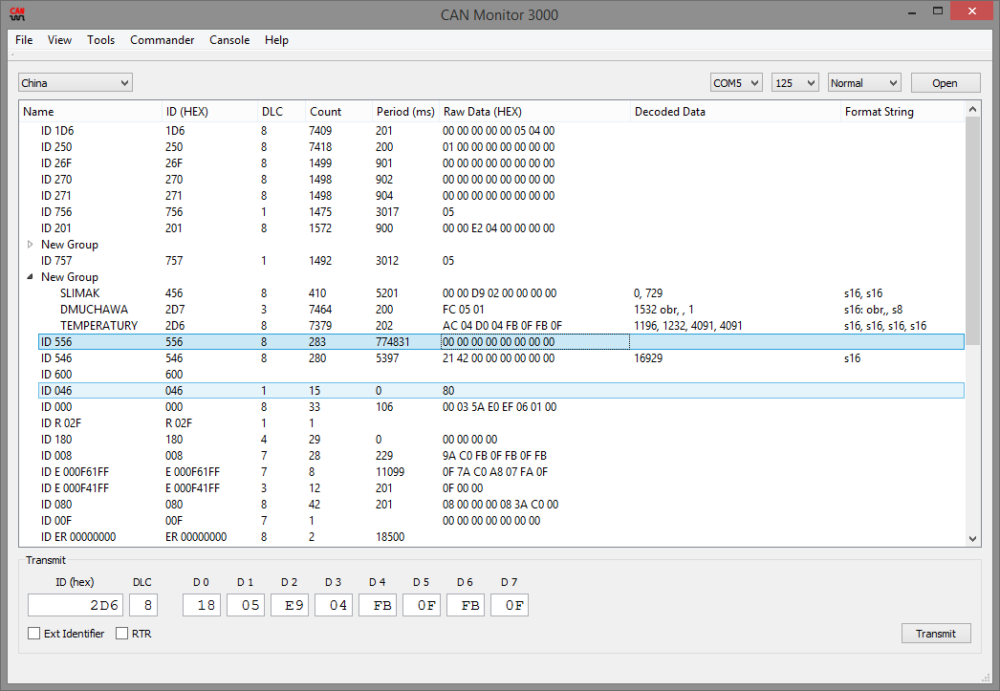
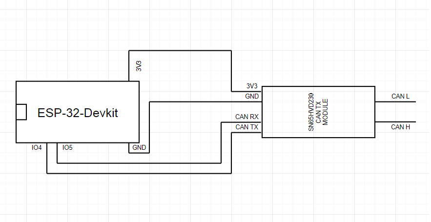

# arduino-canmon-sniffer

This code has been written to sniff and emulate CAN packets
by using CAN Monitor-qt project avaiable at github:
https://github.com/tixiv/CAN-Monitor-qt

It emulates only basic packets of CanAdapterChina class and
it does not support changing any CAN parameters on demand.

CAN bus speed can be changed in code.

Keep in mind that some ESP32 devkits do not support 2000000
serial speed. CP21XX based ones can be reconfigured to support
faster rates by using CP21xxCustomizationUtility from S. Labs.

# My ESP32 setup

# Requirements:
Arduino-CAN library - https://github.com/sandeepmistry/arduino-CAN
